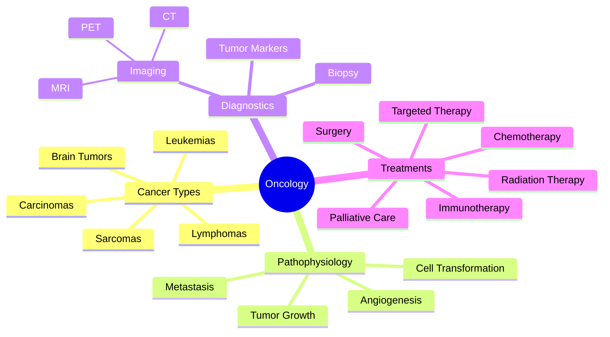

```mermaid
mindmap
  root((Oncology))
    Cancer Types
      Carcinomas
      Sarcomas
      Leukemias
      Lymphomas
      Brain Tumors
    Pathophysiology
      Cell Transformation
      Tumor Growth
      Metastasis
      Angiogenesis
    Diagnostics
      Biopsy
      Imaging
        CT
        MRI
        PET
      Tumor Markers
    Treatments
      Surgery
      Chemotherapy
      Radiation Therapy
      Immunotherapy
      Targeted Therapy
      Palliative Care
```

