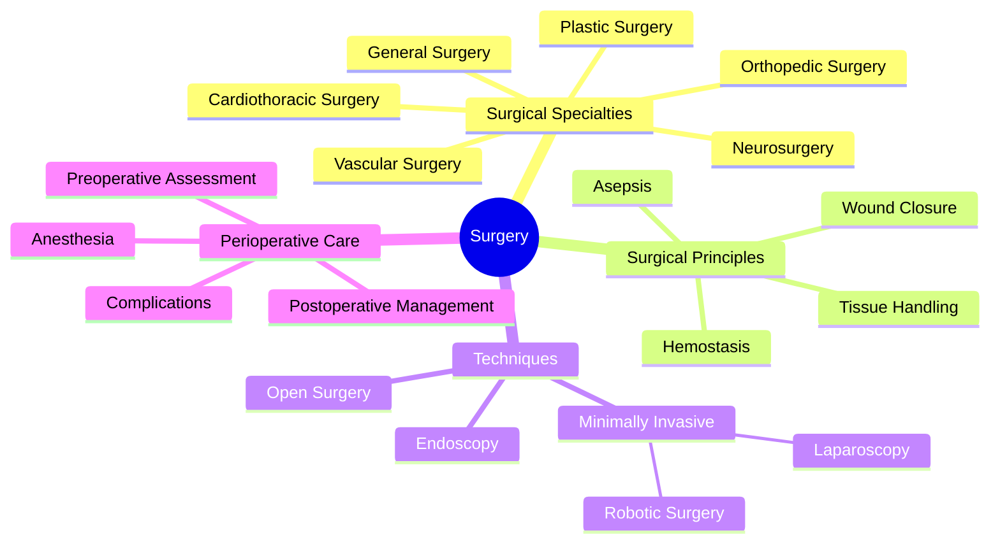

```mermaid
mindmap
  root((Surgery))
    Surgical Specialties
      General Surgery
      Cardiothoracic Surgery
      Neurosurgery
      Orthopedic Surgery
      Plastic Surgery
      Vascular Surgery
    Surgical Principles
      Asepsis
      Hemostasis
      Tissue Handling
      Wound Closure
    Techniques
      Open Surgery
      Minimally Invasive
        Laparoscopy
        Robotic Surgery
      Endoscopy
    Perioperative Care
      Preoperative Assessment
      Anesthesia
      Postoperative Management
      Complications
```

