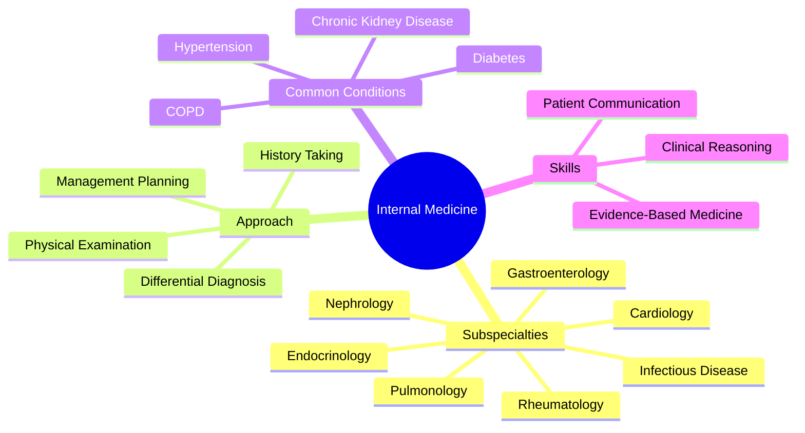

```mermaid
mindmap
  root((Internal Medicine))
    Subspecialties
      Cardiology
      Pulmonology
      Gastroenterology
      Nephrology
      Endocrinology
      Rheumatology
      Infectious Disease
    Approach
      History Taking
      Physical Examination
      Differential Diagnosis
      Management Planning
    Common Conditions
      Hypertension
      Diabetes
      COPD
      Chronic Kidney Disease
    Skills
      Clinical Reasoning
      Evidence-Based Medicine
      Patient Communication
```

