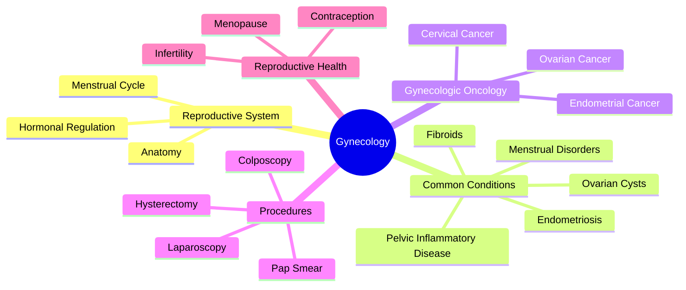

```mermaid
mindmap
  root((Gynecology))
    Reproductive System
      Anatomy
      Menstrual Cycle
      Hormonal Regulation
    Common Conditions
      Menstrual Disorders
      Endometriosis
      Fibroids
      Ovarian Cysts
      Pelvic Inflammatory Disease
    Gynecologic Oncology
      Cervical Cancer
      Ovarian Cancer
      Endometrial Cancer
    Procedures
      Pap Smear
      Colposcopy
      Hysterectomy
      Laparoscopy
    Reproductive Health
      Contraception
      Infertility
      Menopause
```

