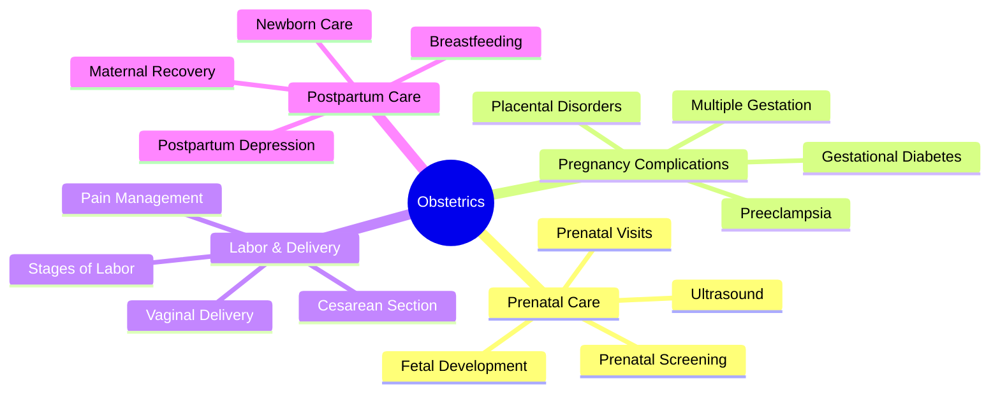

```mermaid
mindmap
  root((Obstetrics))
    Prenatal Care
      Prenatal Visits
      Fetal Development
      Prenatal Screening
      Ultrasound
    Pregnancy Complications
      Gestational Diabetes
      Preeclampsia
      Placental Disorders
      Multiple Gestation
    Labor & Delivery
      Stages of Labor
      Pain Management
      Vaginal Delivery
      Cesarean Section
    Postpartum Care
      Maternal Recovery
      Breastfeeding
      Postpartum Depression
      Newborn Care
```

