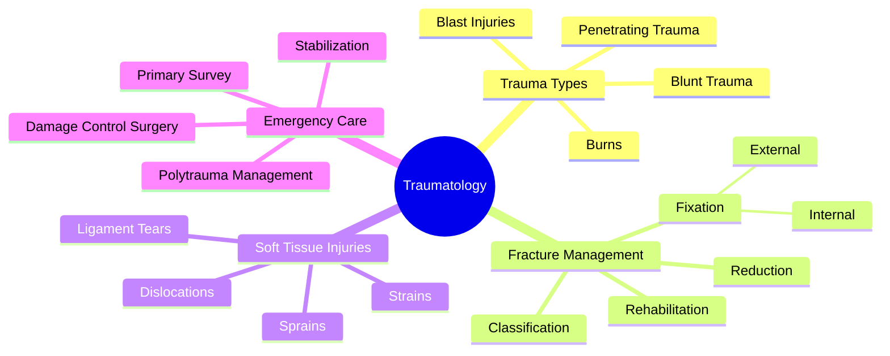

```mermaid
mindmap
  root((Traumatology))
    Trauma Types
      Blunt Trauma
      Penetrating Trauma
      Burns
      Blast Injuries
    Fracture Management
      Classification
      Reduction
      Fixation
        Internal
        External
      Rehabilitation
    Soft Tissue Injuries
      Sprains
      Strains
      Dislocations
      Ligament Tears
    Emergency Care
      Primary Survey
      Stabilization
      Damage Control Surgery
      Polytrauma Management
```

