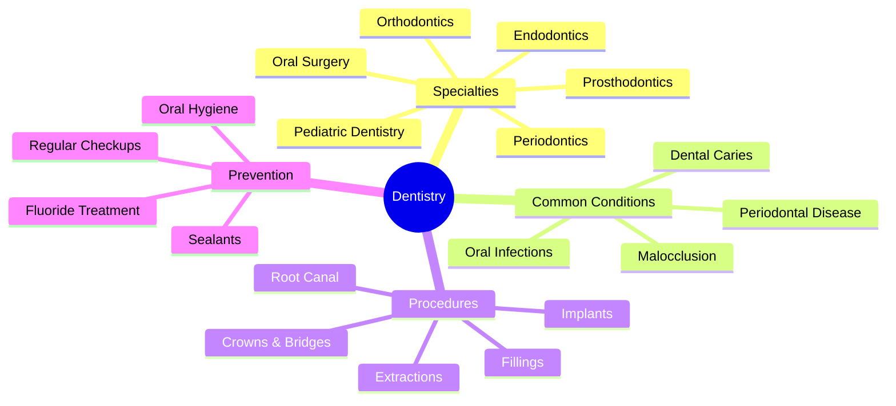

```mermaid
mindmap
  root((Dentistry))
    Specialties
      Orthodontics
      Periodontics
      Endodontics
      Prosthodontics
      Oral Surgery
      Pediatric Dentistry
    Common Conditions
      Dental Caries
      Periodontal Disease
      Malocclusion
      Oral Infections
    Procedures
      Fillings
      Root Canal
      Extractions
      Crowns & Bridges
      Implants
    Prevention
      Oral Hygiene
      Fluoride Treatment
      Sealants
      Regular Checkups
```

