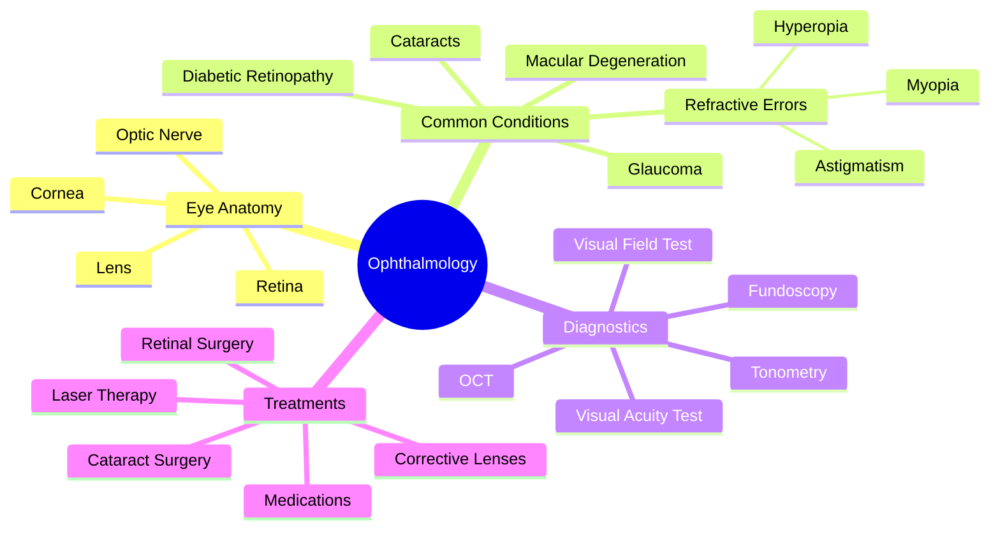

```mermaid
mindmap
  root((Ophthalmology))
    Eye Anatomy
      Cornea
      Lens
      Retina
      Optic Nerve
    Common Conditions
      Refractive Errors
        Myopia
        Hyperopia
        Astigmatism
      Cataracts
      Glaucoma
      Macular Degeneration
      Diabetic Retinopathy
    Diagnostics
      Visual Acuity Test
      Fundoscopy
      Tonometry
      OCT
      Visual Field Test
    Treatments
      Corrective Lenses
      Medications
      Laser Therapy
      Cataract Surgery
      Retinal Surgery
```

