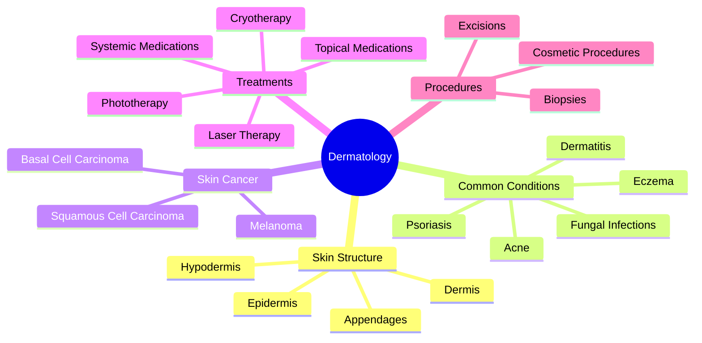

```mermaid
mindmap
  root((Dermatology))
    Skin Structure
      Epidermis
      Dermis
      Hypodermis
      Appendages
    Common Conditions
      Acne
      Eczema
      Psoriasis
      Dermatitis
      Fungal Infections
    Skin Cancer
      Melanoma
      Basal Cell Carcinoma
      Squamous Cell Carcinoma
    Treatments
      Topical Medications
      Systemic Medications
      Phototherapy
      Cryotherapy
      Laser Therapy
    Procedures
      Biopsies
      Excisions
      Cosmetic Procedures
```

