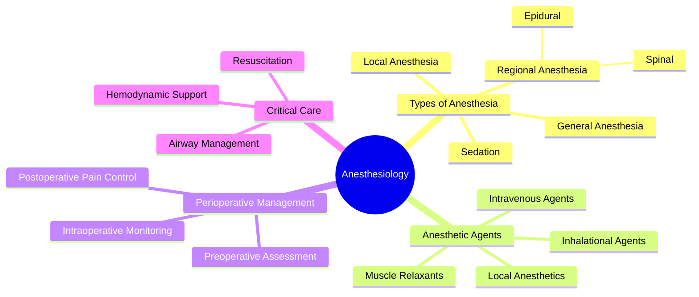

```mermaid
mindmap
  root((Anesthesiology))
    Types of Anesthesia
      General Anesthesia
      Regional Anesthesia
        Spinal
        Epidural
      Local Anesthesia
      Sedation
    Anesthetic Agents
      Inhalational Agents
      Intravenous Agents
      Local Anesthetics
      Muscle Relaxants
    Perioperative Management
      Preoperative Assessment
      Intraoperative Monitoring
      Postoperative Pain Control
    Critical Care
      Airway Management
      Hemodynamic Support
      Resuscitation
```

