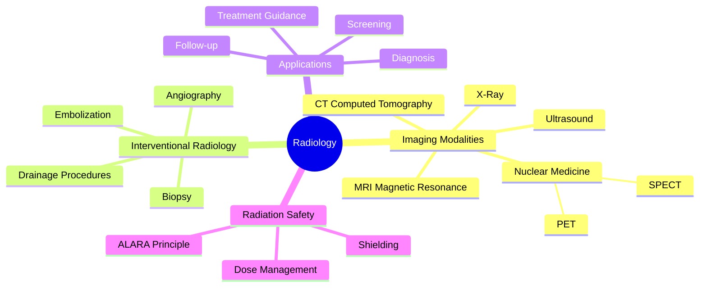

```mermaid
mindmap
  root((Radiology))
    Imaging Modalities
      X-Ray
      CT Computed Tomography
      MRI Magnetic Resonance
      Ultrasound
      Nuclear Medicine
        PET
        SPECT
    Interventional Radiology
      Angiography
      Biopsy
      Drainage Procedures
      Embolization
    Applications
      Diagnosis
      Treatment Guidance
      Screening
      Follow-up
    Radiation Safety
      ALARA Principle
      Shielding
      Dose Management
```

