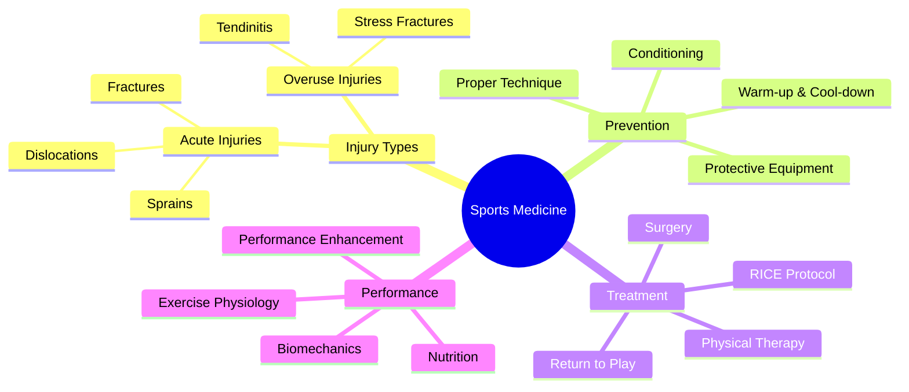

```mermaid
mindmap
  root((Sports Medicine))
    Injury Types
      Acute Injuries
        Fractures
        Sprains
        Dislocations
      Overuse Injuries
        Tendinitis
        Stress Fractures
    Prevention
      Conditioning
      Proper Technique
      Protective Equipment
      Warm-up & Cool-down
    Treatment
      RICE Protocol
      Physical Therapy
      Surgery
      Return to Play
    Performance
      Exercise Physiology
      Nutrition
      Biomechanics
      Performance Enhancement
```

