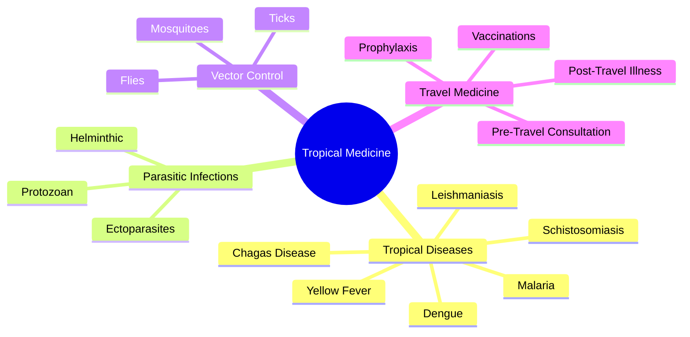

```mermaid
mindmap
  root((Tropical Medicine))
    Tropical Diseases
      Malaria
      Dengue
      Yellow Fever
      Leishmaniasis
      Schistosomiasis
      Chagas Disease
    Parasitic Infections
      Protozoan
      Helminthic
      Ectoparasites
    Vector Control
      Mosquitoes
      Flies
      Ticks
    Travel Medicine
      Pre-Travel Consultation
      Vaccinations
      Prophylaxis
      Post-Travel Illness
```

