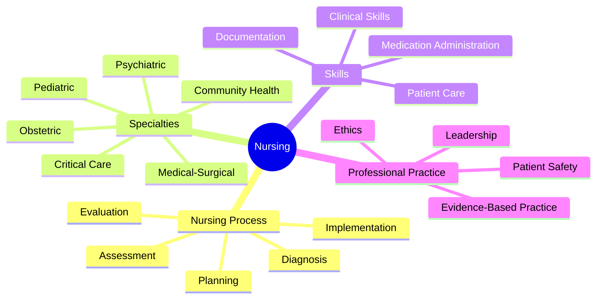

```mermaid
mindmap
  root((Nursing))
    Nursing Process
      Assessment
      Diagnosis
      Planning
      Implementation
      Evaluation
    Specialties
      Medical-Surgical
      Critical Care
      Pediatric
      Obstetric
      Psychiatric
      Community Health
    Skills
      Clinical Skills
      Patient Care
      Medication Administration
      Documentation
    Professional Practice
      Evidence-Based Practice
      Patient Safety
      Ethics
      Leadership
```

