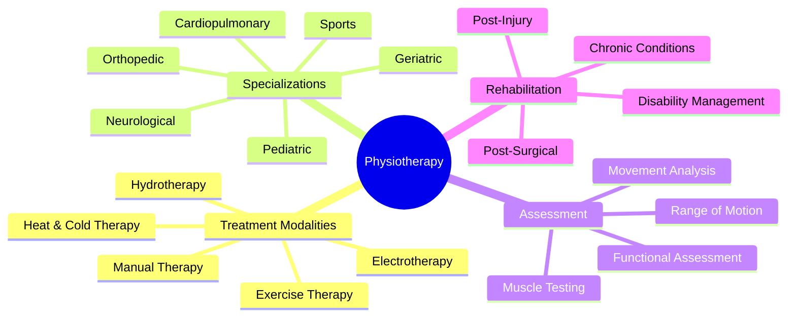

```mermaid
mindmap
  root((Physiotherapy))
    Treatment Modalities
      Manual Therapy
      Exercise Therapy
      Electrotherapy
      Hydrotherapy
      Heat & Cold Therapy
    Specializations
      Orthopedic
      Neurological
      Cardiopulmonary
      Pediatric
      Sports
      Geriatric
    Assessment
      Movement Analysis
      Muscle Testing
      Range of Motion
      Functional Assessment
    Rehabilitation
      Post-Surgical
      Post-Injury
      Chronic Conditions
      Disability Management
```

