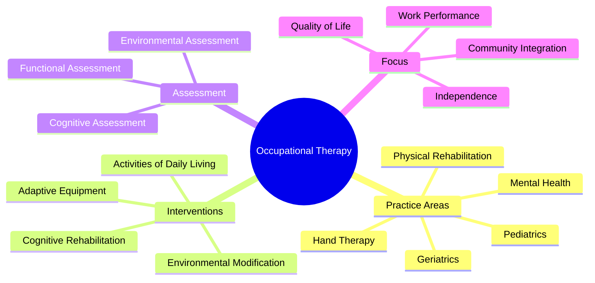

```mermaid
mindmap
  root((Occupational Therapy))
    Practice Areas
      Physical Rehabilitation
      Mental Health
      Pediatrics
      Geriatrics
      Hand Therapy
    Interventions
      Activities of Daily Living
      Adaptive Equipment
      Environmental Modification
      Cognitive Rehabilitation
    Assessment
      Functional Assessment
      Cognitive Assessment
      Environmental Assessment
    Focus
      Independence
      Quality of Life
      Work Performance
      Community Integration
```

