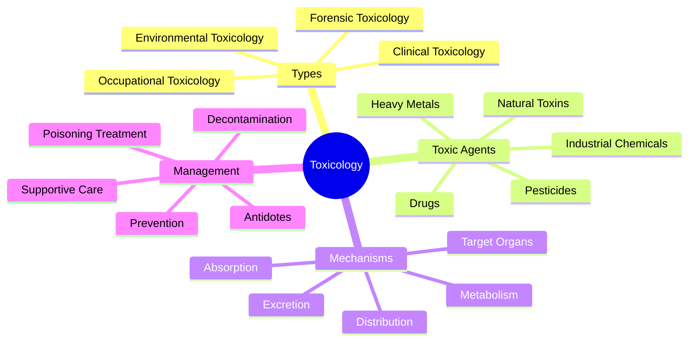

```mermaid
mindmap
  root((Toxicology))
    Types
      Clinical Toxicology
      Environmental Toxicology
      Forensic Toxicology
      Occupational Toxicology
    Toxic Agents
      Drugs
      Pesticides
      Industrial Chemicals
      Heavy Metals
      Natural Toxins
    Mechanisms
      Absorption
      Distribution
      Metabolism
      Excretion
      Target Organs
    Management
      Poisoning Treatment
      Decontamination
      Antidotes
      Supportive Care
      Prevention
```

