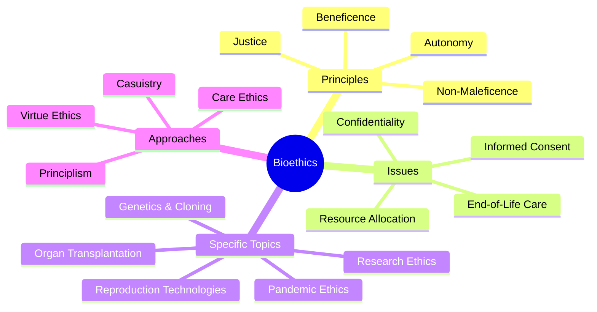

```mermaid
mindmap
  root((Bioethics))
    Principles
      Autonomy
      Beneficence
      Non-Maleficence
      Justice
    Issues
      Informed Consent
      Confidentiality
      End-of-Life Care
      Resource Allocation
    Specific Topics
      Genetics & Cloning
      Reproduction Technologies
      Organ Transplantation
      Research Ethics
      Pandemic Ethics
    Approaches
      Principlism
      Casuistry
      Virtue Ethics
      Care Ethics
```

