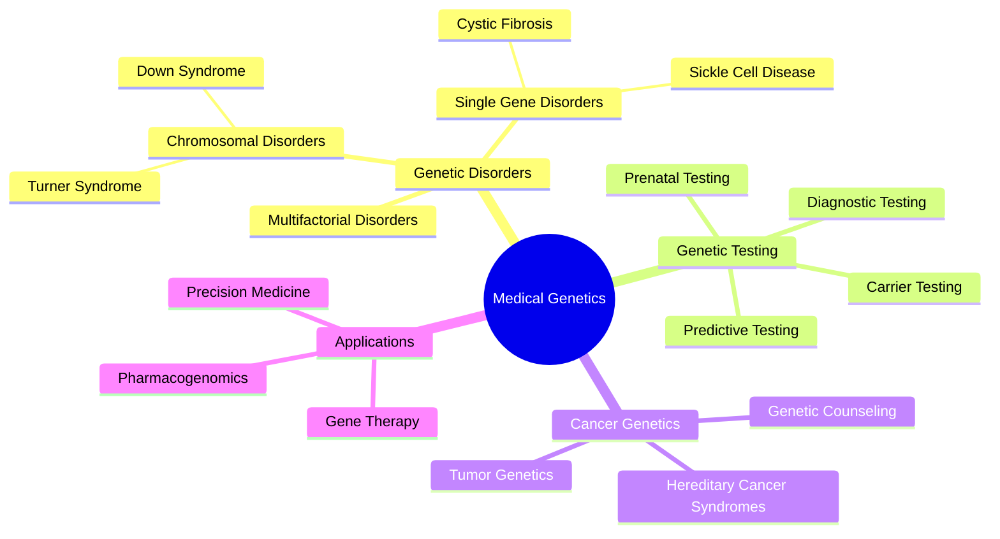

```mermaid
mindmap
  root((Medical Genetics))
    Genetic Disorders
      Chromosomal Disorders
        Down Syndrome
        Turner Syndrome
      Single Gene Disorders
        Cystic Fibrosis
        Sickle Cell Disease
      Multifactorial Disorders
    Genetic Testing
      Diagnostic Testing
      Carrier Testing
      Prenatal Testing
      Predictive Testing
    Cancer Genetics
      Hereditary Cancer Syndromes
      Tumor Genetics
      Genetic Counseling
    Applications
      Pharmacogenomics
      Gene Therapy
      Precision Medicine
```

