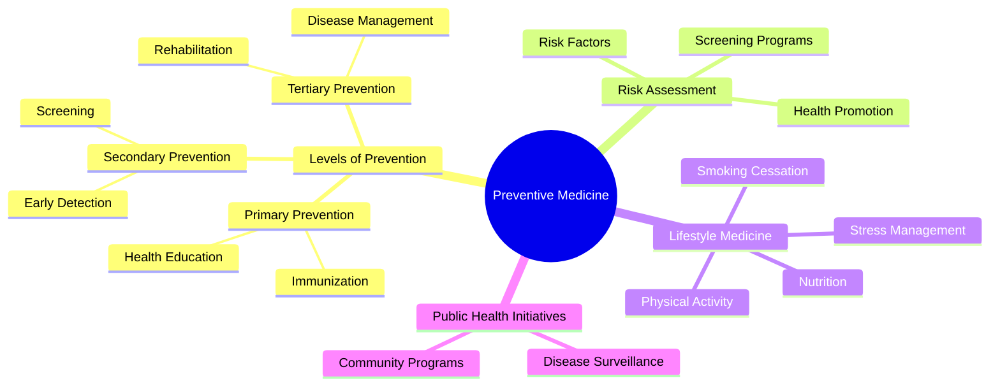

```mermaid
mindmap
  root((Preventive Medicine))
    Levels of Prevention
      Primary Prevention
        Immunization
        Health Education
      Secondary Prevention
        Screening
        Early Detection
      Tertiary Prevention
        Rehabilitation
        Disease Management
    Risk Assessment
      Risk Factors
      Screening Programs
      Health Promotion
    Lifestyle Medicine
      Nutrition
      Physical Activity
      Smoking Cessation
      Stress Management
    Public Health Initiatives
      Disease Surveillance
      Community Programs
```

