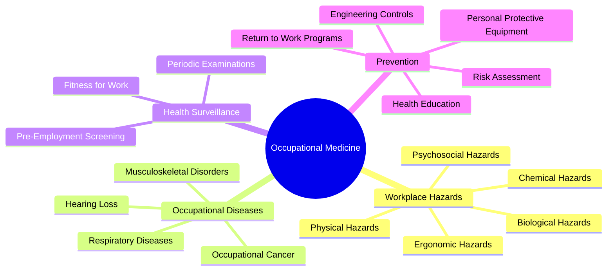

```mermaid
mindmap
  root((Occupational Medicine))
    Workplace Hazards
      Physical Hazards
      Chemical Hazards
      Biological Hazards
      Ergonomic Hazards
      Psychosocial Hazards
    Occupational Diseases
      Respiratory Diseases
      Musculoskeletal Disorders
      Occupational Cancer
      Hearing Loss
    Health Surveillance
      Pre-Employment Screening
      Periodic Examinations
      Fitness for Work
    Prevention
      Risk Assessment
      Engineering Controls
      Personal Protective Equipment
      Health Education
      Return to Work Programs
```

