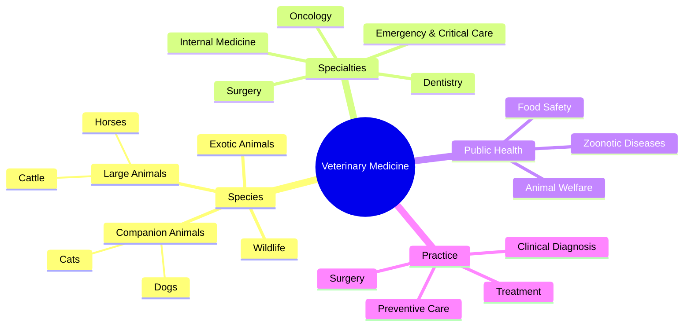

```mermaid
mindmap
  root((Veterinary Medicine))
    Species
      Companion Animals
        Dogs
        Cats
      Large Animals
        Horses
        Cattle
      Exotic Animals
      Wildlife
    Specialties
      Surgery
      Internal Medicine
      Emergency & Critical Care
      Oncology
      Dentistry
    Public Health
      Zoonotic Diseases
      Food Safety
      Animal Welfare
    Practice
      Clinical Diagnosis
      Treatment
      Preventive Care
      Surgery
```

