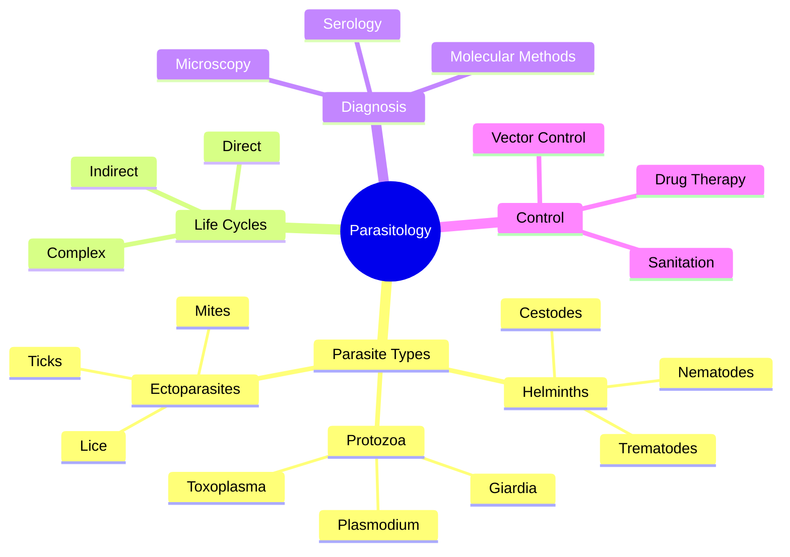

```mermaid
mindmap
  root((Parasitology))
    Parasite Types
      Protozoa
        Plasmodium
        Toxoplasma
        Giardia
      Helminths
        Nematodes
        Cestodes
        Trematodes
      Ectoparasites
        Lice
        Ticks
        Mites
    Life Cycles
      Direct
      Indirect
      Complex
    Diagnosis
      Microscopy
      Serology
      Molecular Methods
    Control
      Drug Therapy
      Vector Control
      Sanitation
```

