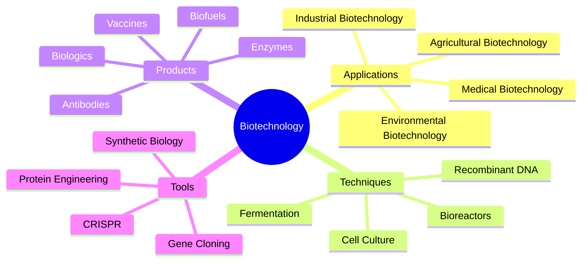

```mermaid
mindmap
  root((Biotechnology))
    Applications
      Medical Biotechnology
      Agricultural Biotechnology
      Industrial Biotechnology
      Environmental Biotechnology
    Techniques
      Recombinant DNA
      Cell Culture
      Fermentation
      Bioreactors
    Products
      Biologics
      Vaccines
      Antibodies
      Enzymes
      Biofuels
    Tools
      CRISPR
      Gene Cloning
      Protein Engineering
      Synthetic Biology
```

