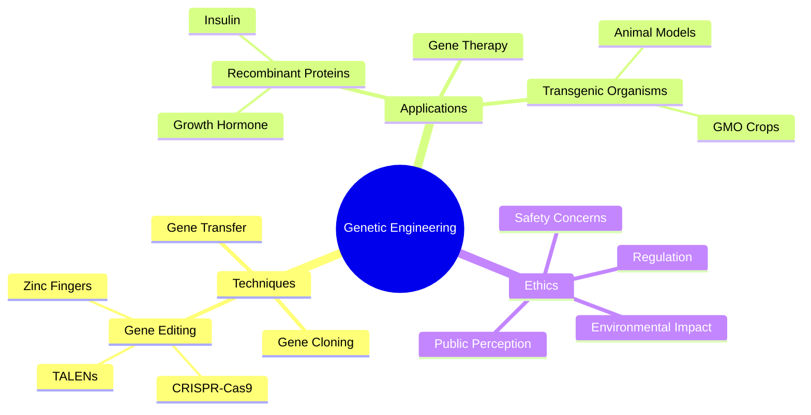

```mermaid
mindmap
  root((Genetic Engineering))
    Techniques
      Gene Cloning
      Gene Editing
        CRISPR-Cas9
        TALENs
        Zinc Fingers
      Gene Transfer
    Applications
      Recombinant Proteins
        Insulin
        Growth Hormone
      Transgenic Organisms
        GMO Crops
        Animal Models
      Gene Therapy
    Ethics
      Safety Concerns
      Environmental Impact
      Regulation
      Public Perception
```

