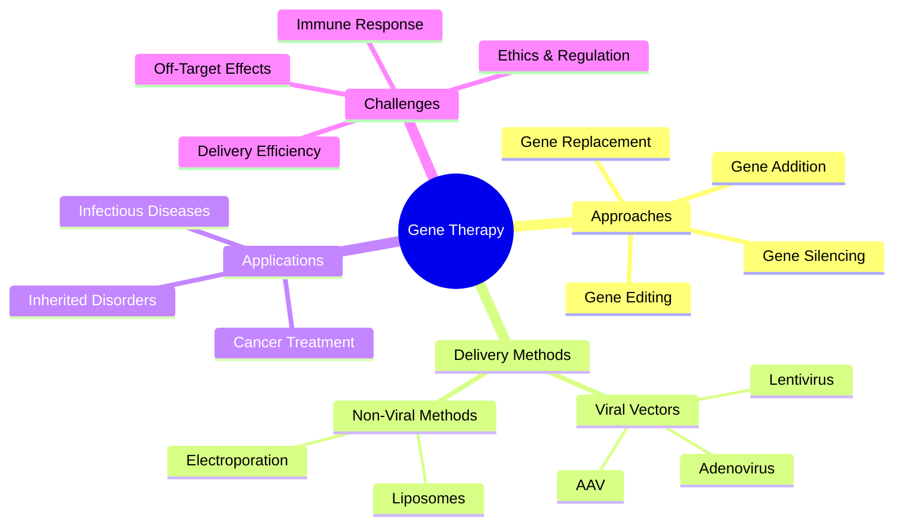

```mermaid
mindmap
  root((Gene Therapy))
    Approaches
      Gene Replacement
      Gene Addition
      Gene Silencing
      Gene Editing
    Delivery Methods
      Viral Vectors
        Adenovirus
        AAV
        Lentivirus
      Non-Viral Methods
        Liposomes
        Electroporation
    Applications
      Inherited Disorders
      Cancer Treatment
      Infectious Diseases
    Challenges
      Immune Response
      Off-Target Effects
      Delivery Efficiency
      Ethics & Regulation
```

