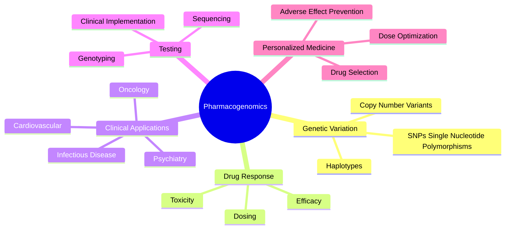

```mermaid
mindmap
  root((Pharmacogenomics))
    Genetic Variation
      SNPs Single Nucleotide Polymorphisms
      Copy Number Variants
      Haplotypes
    Drug Response
      Efficacy
      Toxicity
      Dosing
    Clinical Applications
      Oncology
      Cardiovascular
      Psychiatry
      Infectious Disease
    Testing
      Genotyping
      Sequencing
      Clinical Implementation
    Personalized Medicine
      Drug Selection
      Dose Optimization
      Adverse Effect Prevention
```

