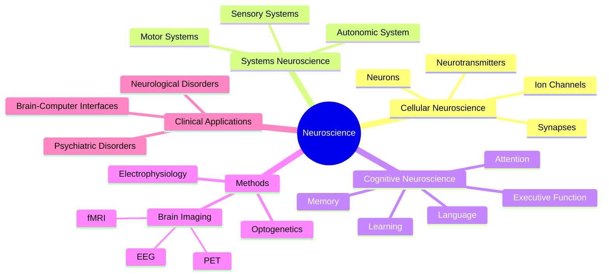

```mermaid
mindmap
  root((Neuroscience))
    Cellular Neuroscience
      Neurons
      Synapses
      Neurotransmitters
      Ion Channels
    Systems Neuroscience
      Sensory Systems
      Motor Systems
      Autonomic System
    Cognitive Neuroscience
      Memory
      Learning
      Language
      Attention
      Executive Function
    Methods
      Electrophysiology
      Brain Imaging
        fMRI
        PET
        EEG
      Optogenetics
    Clinical Applications
      Neurological Disorders
      Psychiatric Disorders
      Brain-Computer Interfaces
```

