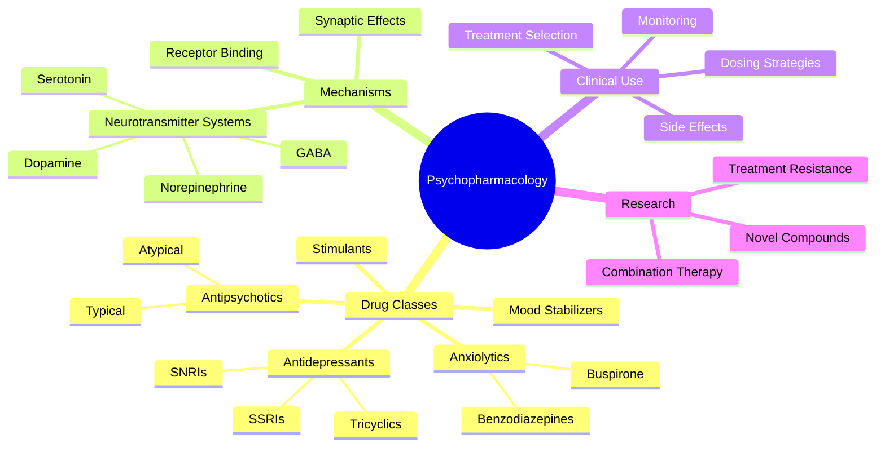

```mermaid
mindmap
  root((Psychopharmacology))
    Drug Classes
      Antidepressants
        SSRIs
        SNRIs
        Tricyclics
      Anxiolytics
        Benzodiazepines
        Buspirone
      Antipsychotics
        Typical
        Atypical
      Mood Stabilizers
      Stimulants
    Mechanisms
      Neurotransmitter Systems
        Serotonin
        Dopamine
        Norepinephrine
        GABA
      Receptor Binding
      Synaptic Effects
    Clinical Use
      Treatment Selection
      Dosing Strategies
      Monitoring
      Side Effects
    Research
      Novel Compounds
      Treatment Resistance
      Combination Therapy
```

