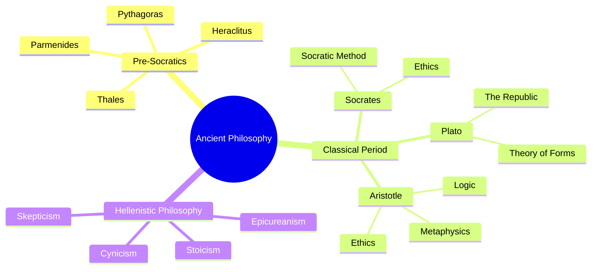

```mermaid
mindmap
  root((Ancient Philosophy))
    Pre-Socratics
      Thales
      Heraclitus
      Pythagoras
      Parmenides
    Classical Period
      Socrates
        Socratic Method
        Ethics
      Plato
        Theory of Forms
        The Republic
      Aristotle
        Logic
        Metaphysics
        Ethics
    Hellenistic Philosophy
      Stoicism
      Epicureanism
      Skepticism
      Cynicism
```

