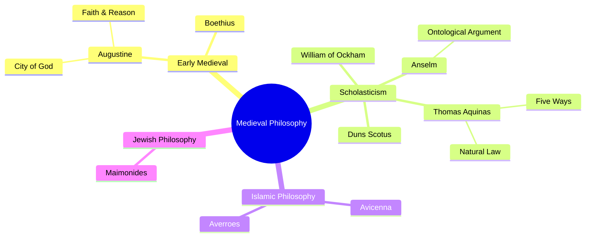

```mermaid
mindmap
  root((Medieval Philosophy))
    Early Medieval
      Augustine
        Faith & Reason
        City of God
      Boethius
    Scholasticism
      Anselm
        Ontological Argument
      Thomas Aquinas
        Natural Law
        Five Ways
      Duns Scotus
      William of Ockham
    Islamic Philosophy
      Avicenna
      Averroes
    Jewish Philosophy
      Maimonides
```

