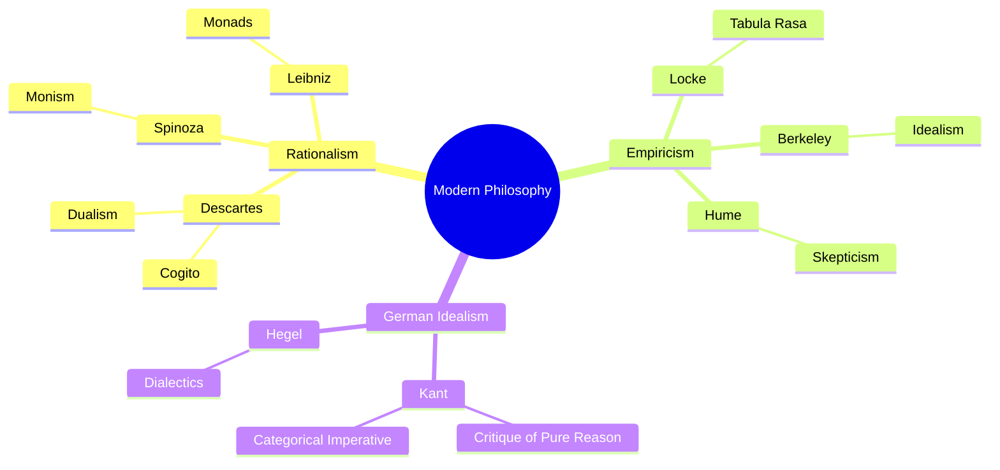

```mermaid
mindmap
  root((Modern Philosophy))
    Rationalism
      Descartes
        Cogito
        Dualism
      Spinoza
        Monism
      Leibniz
        Monads
    Empiricism
      Locke
        Tabula Rasa
      Berkeley
        Idealism
      Hume
        Skepticism
    German Idealism
      Kant
        Critique of Pure Reason
        Categorical Imperative
      Hegel
        Dialectics
```

