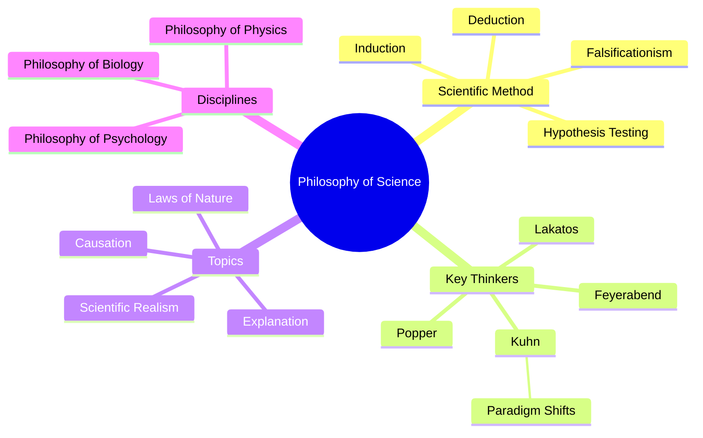

```mermaid
mindmap
  root((Philosophy of Science))
    Scientific Method
      Induction
      Deduction
      Hypothesis Testing
      Falsificationism
    Key Thinkers
      Popper
      Kuhn
        Paradigm Shifts
      Lakatos
      Feyerabend
    Topics
      Scientific Realism
      Laws of Nature
      Causation
      Explanation
    Disciplines
      Philosophy of Physics
      Philosophy of Biology
      Philosophy of Psychology
```

