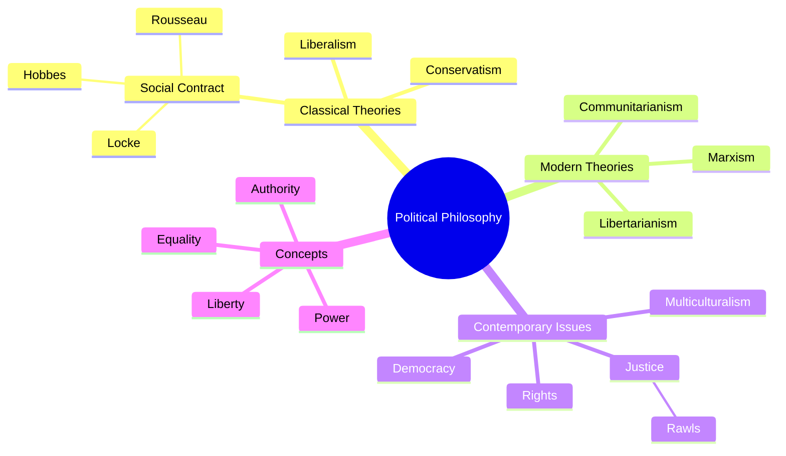

```mermaid
mindmap
  root((Political Philosophy))
    Classical Theories
      Social Contract
        Hobbes
        Locke
        Rousseau
      Liberalism
      Conservatism
    Modern Theories
      Marxism
      Libertarianism
      Communitarianism
    Contemporary Issues
      Justice
        Rawls
      Rights
      Democracy
      Multiculturalism
    Concepts
      Liberty
      Equality
      Authority
      Power
```

