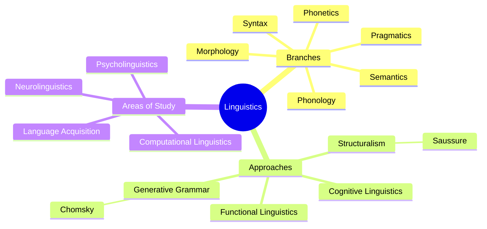

```mermaid
mindmap
  root((Linguistics))
    Branches
      Phonetics
      Phonology
      Morphology
      Syntax
      Semantics
      Pragmatics
    Approaches
      Structuralism
        Saussure
      Generative Grammar
        Chomsky
      Cognitive Linguistics
      Functional Linguistics
    Areas of Study
      Language Acquisition
      Psycholinguistics
      Neurolinguistics
      Computational Linguistics
```

