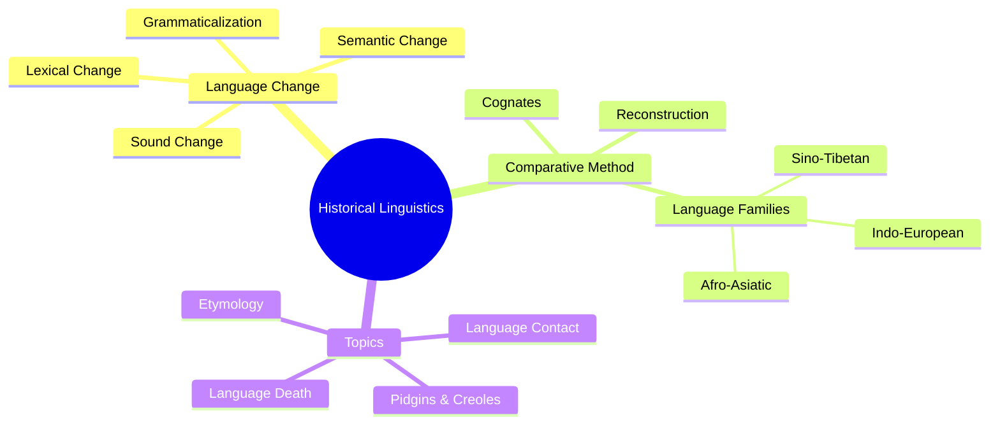

```mermaid
mindmap
  root((Historical Linguistics))
    Language Change
      Sound Change
      Grammaticalization
      Semantic Change
      Lexical Change
    Comparative Method
      Language Families
        Indo-European
        Sino-Tibetan
        Afro-Asiatic
      Reconstruction
      Cognates
    Topics
      Language Contact
      Pidgins & Creoles
      Language Death
      Etymology
```

