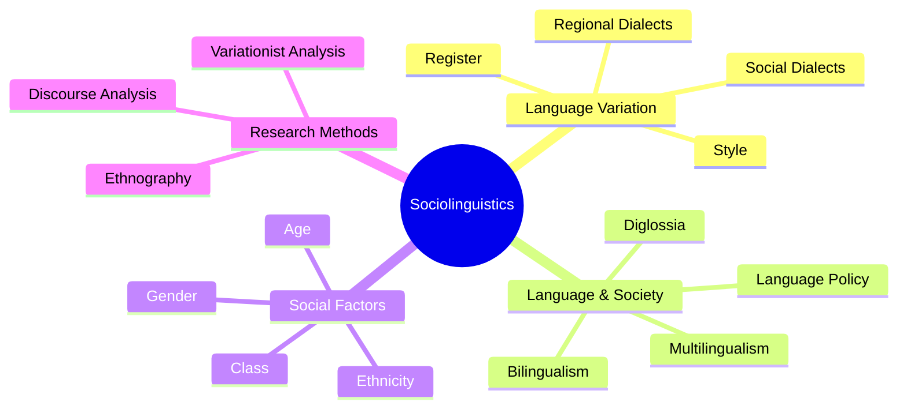

```mermaid
mindmap
  root((Sociolinguistics))
    Language Variation
      Regional Dialects
      Social Dialects
      Register
      Style
    Language & Society
      Diglossia
      Bilingualism
      Multilingualism
      Language Policy
    Social Factors
      Class
      Gender
      Ethnicity
      Age
    Research Methods
      Variationist Analysis
      Ethnography
      Discourse Analysis
```

