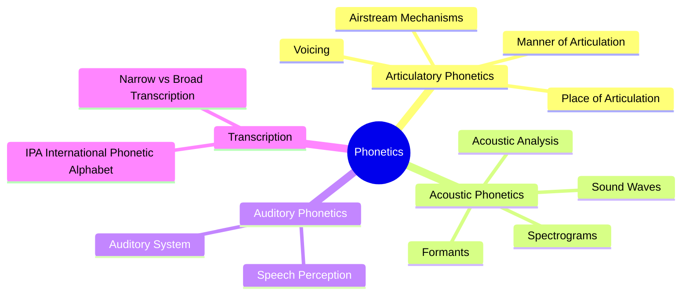

```mermaid
mindmap
  root((Phonetics))
    Articulatory Phonetics
      Place of Articulation
      Manner of Articulation
      Voicing
      Airstream Mechanisms
    Acoustic Phonetics
      Sound Waves
      Formants
      Spectrograms
      Acoustic Analysis
    Auditory Phonetics
      Speech Perception
      Auditory System
    Transcription
      IPA International Phonetic Alphabet
      Narrow vs Broad Transcription
```

