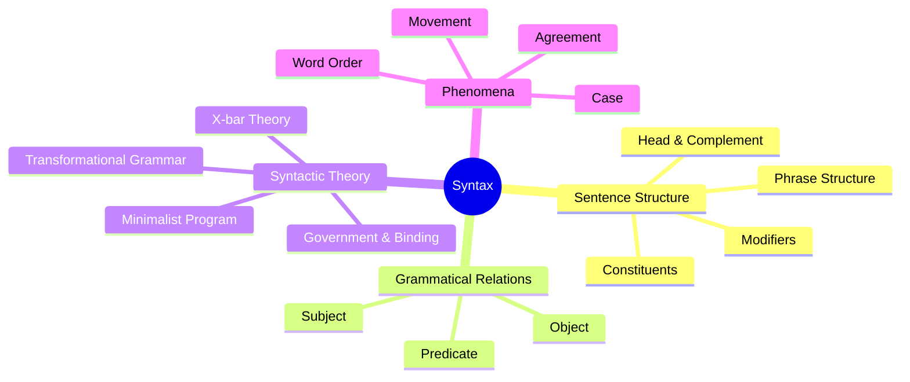

```mermaid
mindmap
  root((Syntax))
    Sentence Structure
      Constituents
      Phrase Structure
      Head & Complement
      Modifiers
    Grammatical Relations
      Subject
      Object
      Predicate
    Syntactic Theory
      Transformational Grammar
      X-bar Theory
      Government & Binding
      Minimalist Program
    Phenomena
      Word Order
      Agreement
      Case
      Movement
```

