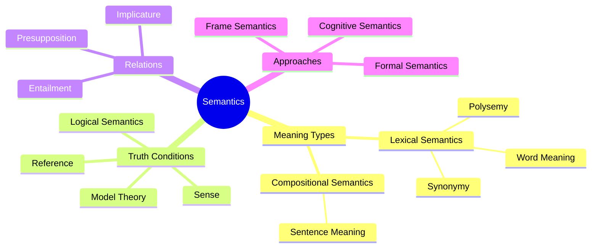

```mermaid
mindmap
  root((Semantics))
    Meaning Types
      Lexical Semantics
        Word Meaning
        Polysemy
        Synonymy
      Compositional Semantics
        Sentence Meaning
    Truth Conditions
      Logical Semantics
      Model Theory
      Reference
      Sense
    Relations
      Entailment
      Presupposition
      Implicature
    Approaches
      Formal Semantics
      Cognitive Semantics
      Frame Semantics
```

