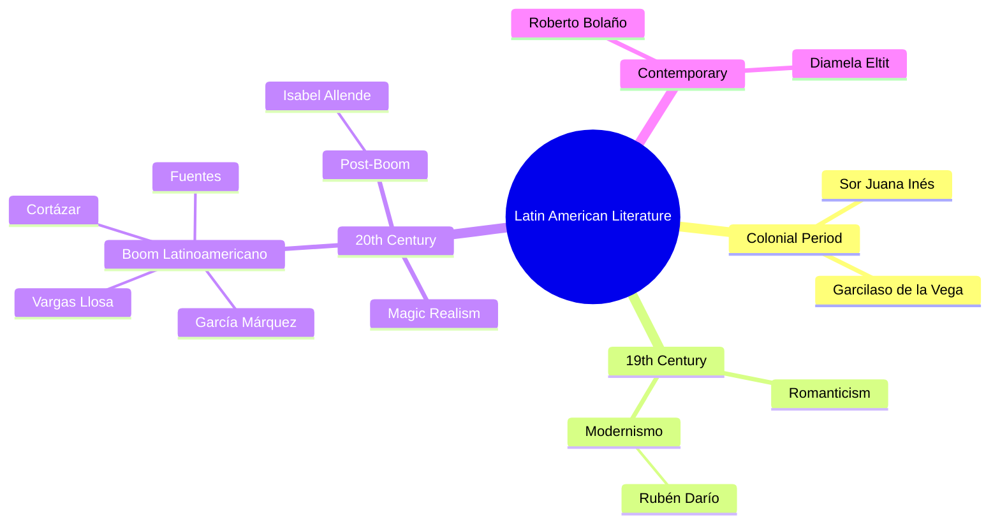

```mermaid
mindmap
  root((Latin American Literature))
    Colonial Period
      Sor Juana Inés
      Garcilaso de la Vega
    19th Century
      Romanticism
      Modernismo
        Rubén Darío
    20th Century
      Boom Latinoamericano
        García Márquez
        Vargas Llosa
        Cortázar
        Fuentes
      Magic Realism
      Post-Boom
        Isabel Allende
    Contemporary
      Roberto Bolaño
      Diamela Eltit
```

