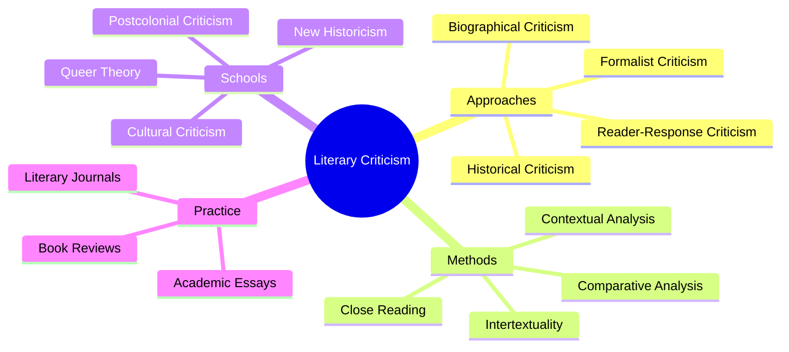

```mermaid
mindmap
  root((Literary Criticism))
    Approaches
      Historical Criticism
      Biographical Criticism
      Formalist Criticism
      Reader-Response Criticism
    Methods
      Close Reading
      Contextual Analysis
      Comparative Analysis
      Intertextuality
    Schools
      New Historicism
      Cultural Criticism
      Postcolonial Criticism
      Queer Theory
    Practice
      Book Reviews
      Academic Essays
      Literary Journals
```

