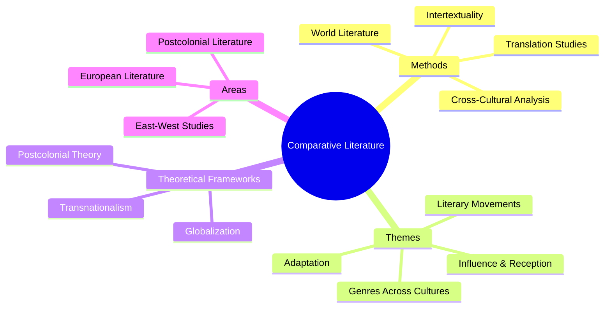

```mermaid
mindmap
  root((Comparative Literature))
    Methods
      Cross-Cultural Analysis
      Translation Studies
      Intertextuality
      World Literature
    Themes
      Literary Movements
      Genres Across Cultures
      Influence & Reception
      Adaptation
    Theoretical Frameworks
      Postcolonial Theory
      Transnationalism
      Globalization
    Areas
      East-West Studies
      European Literature
      Postcolonial Literature
```

