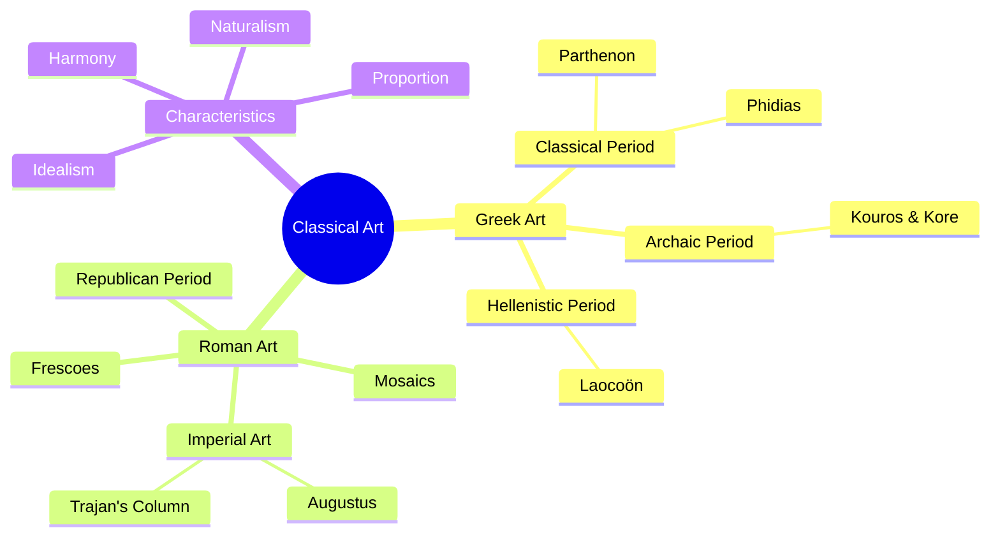

```mermaid
mindmap
  root((Classical Art))
    Greek Art
      Archaic Period
        Kouros & Kore
      Classical Period
        Parthenon
        Phidias
      Hellenistic Period
        Laocoön
    Roman Art
      Republican Period
      Imperial Art
        Augustus
        Trajan's Column
      Mosaics
      Frescoes
    Characteristics
      Idealism
      Naturalism
      Proportion
      Harmony
```

