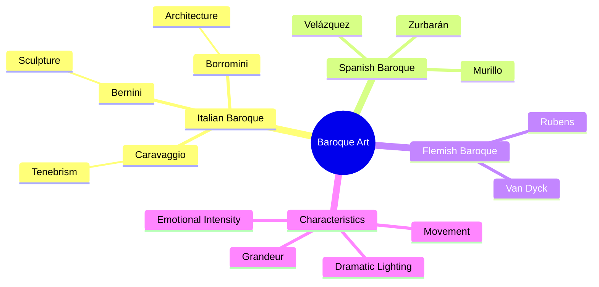

```mermaid
mindmap
  root((Baroque Art))
    Italian Baroque
      Caravaggio
        Tenebrism
      Bernini
        Sculpture
      Borromini
        Architecture
    Spanish Baroque
      Velázquez
      Zurbarán
      Murillo
    Flemish Baroque
      Rubens
      Van Dyck
    Characteristics
      Dramatic Lighting
      Movement
      Emotional Intensity
      Grandeur
```

