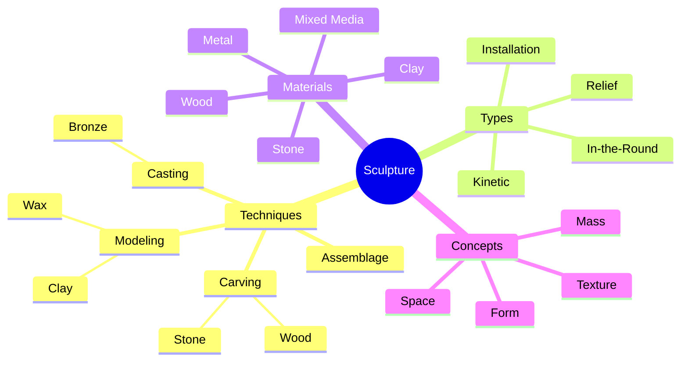

```mermaid
mindmap
  root((Sculpture))
    Techniques
      Carving
        Stone
        Wood
      Modeling
        Clay
        Wax
      Casting
        Bronze
      Assemblage
    Types
      Relief
      In-the-Round
      Kinetic
      Installation
    Materials
      Stone
      Metal
      Clay
      Wood
      Mixed Media
    Concepts
      Form
      Space
      Mass
      Texture
```

