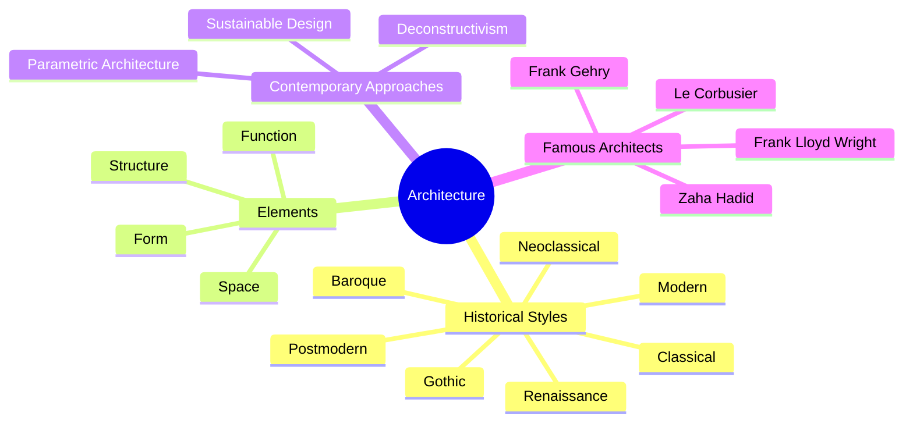

```mermaid
mindmap
  root((Architecture))
    Historical Styles
      Classical
      Gothic
      Renaissance
      Baroque
      Neoclassical
      Modern
      Postmodern
    Elements
      Structure
      Space
      Form
      Function
    Contemporary Approaches
      Sustainable Design
      Parametric Architecture
      Deconstructivism
    Famous Architects
      Frank Lloyd Wright
      Le Corbusier
      Zaha Hadid
      Frank Gehry
```

