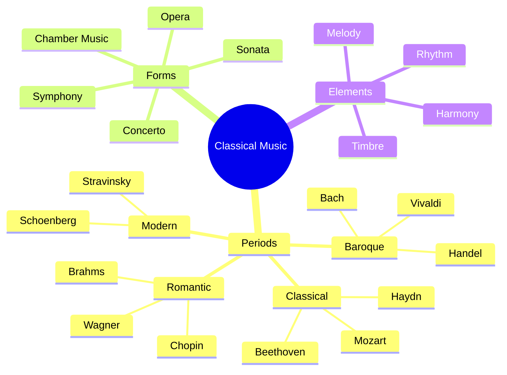

```mermaid
mindmap
  root((Classical Music))
    Periods
      Baroque
        Bach
        Handel
        Vivaldi
      Classical
        Mozart
        Haydn
        Beethoven
      Romantic
        Chopin
        Wagner
        Brahms
      Modern
        Stravinsky
        Schoenberg
    Forms
      Symphony
      Concerto
      Sonata
      Opera
      Chamber Music
    Elements
      Melody
      Harmony
      Rhythm
      Timbre
```

