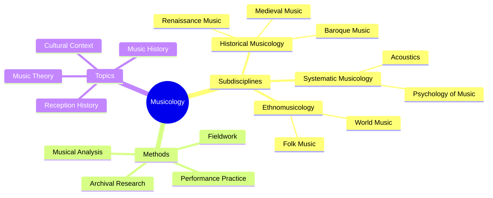

```mermaid
mindmap
  root((Musicology))
    Subdisciplines
      Historical Musicology
        Medieval Music
        Renaissance Music
        Baroque Music
      Ethnomusicology
        World Music
        Folk Music
      Systematic Musicology
        Acoustics
        Psychology of Music
    Methods
      Archival Research
      Performance Practice
      Musical Analysis
      Fieldwork
    Topics
      Music History
      Music Theory
      Cultural Context
      Reception History
```

