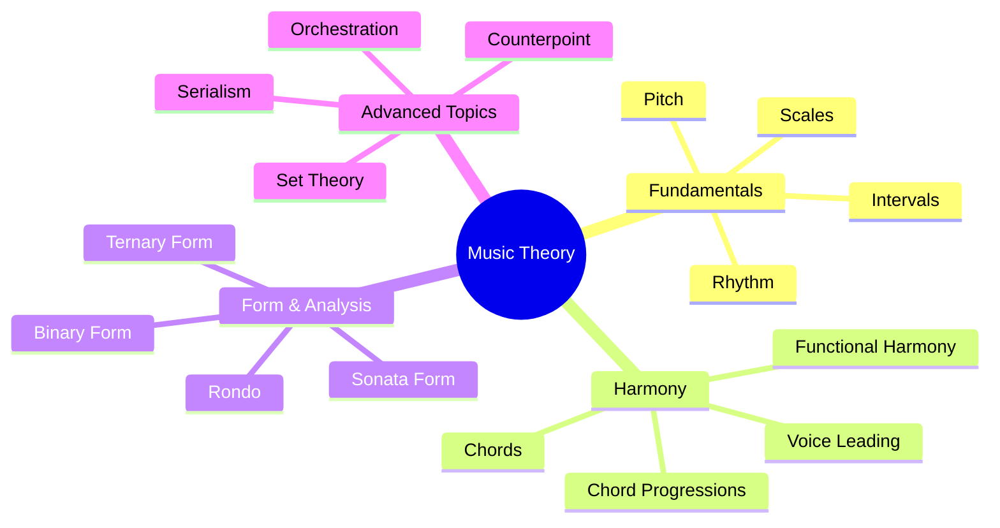

```mermaid
mindmap
  root((Music Theory))
    Fundamentals
      Pitch
      Rhythm
      Scales
      Intervals
    Harmony
      Chords
      Chord Progressions
      Functional Harmony
      Voice Leading
    Form & Analysis
      Binary Form
      Ternary Form
      Sonata Form
      Rondo
    Advanced Topics
      Counterpoint
      Orchestration
      Serialism
      Set Theory
```

